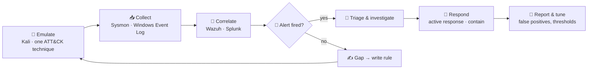

<div align="center">


<a href="https://hackwithsahil.vercel.app"></a>

<br/>

[](https://hackwithsahil.vercel.app)
[](https://hackwithsahil.vercel.app/resumes/Sahil_Nikam_SOC_Analyst.pdf)
[](https://www.linkedin.com/in/sahilnikam-soc)
<br/>
[](https://vrikaan.com)
[](https://www.youtube.com/@HackWithSahilYT)
[](mailto:sahilnikam133@gmail.com)

</div>

---

### `$ whoami`

```yaml
analyst:
  name:        Sahil Anil Nikam
  role:        SOC Analyst (L1) · Blue Team · VAPT
  location:    Nashik, Maharashtra, India
  experience:
    - SOC Analyst Intern      @ ESCOSS LLP     # Mar–Jun 2026 · Wazuh, Splunk, IR
    - Founder & Security Lead @ VRIKAAN        # 2024–present · AI threat detection
    - Cyber Security Intern   @ Academor       # Aug–Sep 2023 · recon, phishing analysis
  education:   B.Tech CSE, Sandip University (2026) · CGPA 8.53
  certified:   SevenMentors SOC Analyst Program (5/5: Networking, Linux, CEH, WAPT, Python for SOC)
  recognised:  The Cyber 50 — India's Elite Founders List (Indian Startup Times)
  focus:       [alert triage, log correlation, threat hunting, detection engineering, incident response]
  open_to:     SOC Analyst (L1) · Detection Engineering roles
```

<div align="center">

| 🛡️ **3 months** | 🎓 **5 / 5** | 🎯 **T1110 validated** | 🏅 **Cyber 50** |
|:---:|:---:|:---:|:---:|
| Enterprise SOC internship | SOC program modules certified | Custom Wazuh rule, fired in lab | India's elite founders list |

</div>

---

### 🔁 How I work: the detection loop

Every technique is mapped to ATT&CK **before** it runs, then hunted from the defender side. If nothing fires, that's a gap: I write the rule and run the technique again.



---

### 🎯 MITRE ATT&CK coverage

| ATT&CK | Technique | Tactic | Status | Evidence |
|---|---|---|---|---|
| [T1110](https://attack.mitre.org/techniques/T1110/) | Brute Force | Credential Access | ✅ **validated in lab** | Wazuh rule `100211` fired, 5 Sep 2026 |
| [T1059](https://attack.mitre.org/techniques/T1059/) | Command & Scripting Interpreter | Execution | 🟢 detected | [silent-operator](https://github.com/sahilnikam2410/silent-operator) |
| [T1046](https://attack.mitre.org/techniques/T1046/) | Network Service Discovery | Discovery | 🟢 detected | [silent-operator](https://github.com/sahilnikam2410/silent-operator) |
| [T1566](https://attack.mitre.org/techniques/T1566/) | Phishing | Initial Access | 🟢 detected | [silent-operator](https://github.com/sahilnikam2410/silent-operator) |
| [T1190](https://attack.mitre.org/techniques/T1190/) | Exploit Public-Facing Application | Initial Access | 🟡 assessed | [silent-operator](https://github.com/sahilnikam2410/silent-operator) |
| [T1071.001](https://attack.mitre.org/techniques/T1071/001/) | Application Layer Protocol: Web | Command & Control | 🔵 research | [protocol-cinema](https://github.com/sahilnikam2410/protocol-cinema) |

<sub>✅ validated = rule fired in a controlled run and the event was captured · 🟢 detected = telemetry surfaced it and an alert fired · 🟡 assessed = exercised offensively, findings documented · 🔵 research = studied in an authorised lab, turned into detection logic</sub>

<details>
<summary><b>🧾 Detection-as-code: the rule that fired (Wazuh XML + Sigma)</b></summary>
<br/>

**Wazuh: Windows brute force** (validated 2026-09-05 on `WIN-SERVER-2022`)

```xml
<group name="authentication_failures,windows,">
  <rule id="100211" level="12" frequency="5" timeframe="60">
    <if_matched_sid>60122</if_matched_sid>   <!-- built-in Windows logon failure -->
    <same_source_ip />                       <!-- load-bearing: one source, not any mix -->
    <description>Brute-force attack detected - multiple Windows logon failures</description>
    <mitre><id>T1110</id></mitre>
  </rule>
</group>
```

**Same logic as Sigma** (portable to Splunk / Elastic)

```yaml
title: Windows brute force followed by success
status: experimental
logsource: { product: windows, service: security }
detection:
  failures: { EventID: 4625 }
  success:  { EventID: 4624 }
  timeframe: 2m
  condition: failures | count() by IpAddress > 5 and success
falsepositives:
  - Service accounts with stale cached credentials
  - Password managers retrying after a change
level: high
tags: [attack.credential_access, attack.t1110]
```

Isolated failures raised nothing, which is the point: a correlation rule is only worth having if it stays quiet on noise.

</details>

---

### 🧪 Featured work

| | Project | What it proves |
|:---:|---|---|
| 🛰️ | **[The Silent Operator](https://github.com/sahilnikam2410/silent-operator)** · [case study](https://hackwithsahil.vercel.app/work/silent-operator) | End-to-end SOC lab (Wazuh, Sysmon, Kali, Windows). Red-team runs mapped to ATT&CK, hunted from the blue side, gaps closed with new rules. |
| 🖥️ | **[Multi-Endpoint Monitoring Lab](https://github.com/sahilnikam2410/monitoring-lab)** · [case study](https://hackwithsahil.vercel.app/work/monitoring-lab) | Agent-based log forwarding from several endpoints into centralised Wazuh / Splunk dashboards, built and documented from scratch. |
| 🍯 | **[Protocol Honeypot](https://github.com/sahilnikam2410/protocol-honeypot)** · [case study](https://hackwithsahil.vercel.app/work/protocol-honeypot) | Network IDS + honeypot that profiles recon and unauthorised access into alerts an analyst can act on, not raw noise. |
| 🎞️ | **[Protocol Cinema](https://github.com/sahilnikam2410/protocol-cinema)** · [case study](https://hackwithsahil.vercel.app/work/protocol-cinema) | Steganographic C2 over public APIs, studied in an authorised lab and turned into outbound-channel detection logic. |
| 🛡️ | **[VRIKAAN](https://github.com/sahilnikam2410/vrikaan)** · [live](https://vrikaan.com) | AI threat-detection platform: phishing / scam detection, breach and dark-web exposure, real-time monitoring. Server-side payment verification, rate limits, scheduled backups. |
| 🌐 | **[Portfolio](https://github.com/sahilnikam2410/portfolio)** · [live](https://hackwithsahil.vercel.app) | SOC-terminal portfolio: ATT&CK coverage, case studies, interactive shell. CI-tested, hardened security headers. |

---

### 🧰 Toolkit

**SIEM & log analysis**
<br/>


**Detection & response:** log correlation · alert triage · threat hunting · incident response · active-response automation · SOC reporting & escalation

**Network analysis**
<br/>


**Offensive / VAPT** <sub>(authorised & lab only)</sub>
<br/>


**Systems & code**
<br/>


---

### 📜 Certifications & training

| Certification | Issuer |
|---|---|
| SOC Analyst Program: all 5 modules (Networking · Linux · CEH · WAPT · Python for SOC) | SevenMentors |
| Cybersecurity Analyst Job Simulation (2024) | TATA / Forage |
| Cybersecurity (2024) | Tech Mahindra Foundation / Skill India |
| IT Security Foundations: Network Security (2025) | LinkedIn Learning |
| Ethical Hacking: SQL Injection (2024) | LinkedIn Learning |

---

### 📡 Currently

- 📓 Posting **#100DaysOfSOC** on [LinkedIn](https://www.linkedin.com/in/sahilnikam-soc): one SOC concept or investigation a day
- 🧠 Porting lab detections to **Sigma** so they move between Wazuh, Splunk and Elastic unchanged
- 🛡️ Building **[VRIKAAN](https://vrikaan.com)**: turning live phishing campaigns into automated detection logic

---

<div align="center">

<picture>
  <source media="(prefers-color-scheme: dark)" srcset="https://raw.githubusercontent.com/sahilnikam2410/sahilnikam2410/output/github-contribution-grid-snake-dark.svg" />
  
</picture>

<sub>🔒 All offensive-security work is performed on infrastructure I own or under written authorisation. No live third-party targets.</sub>


</div>
